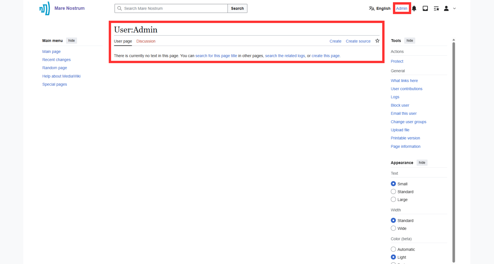
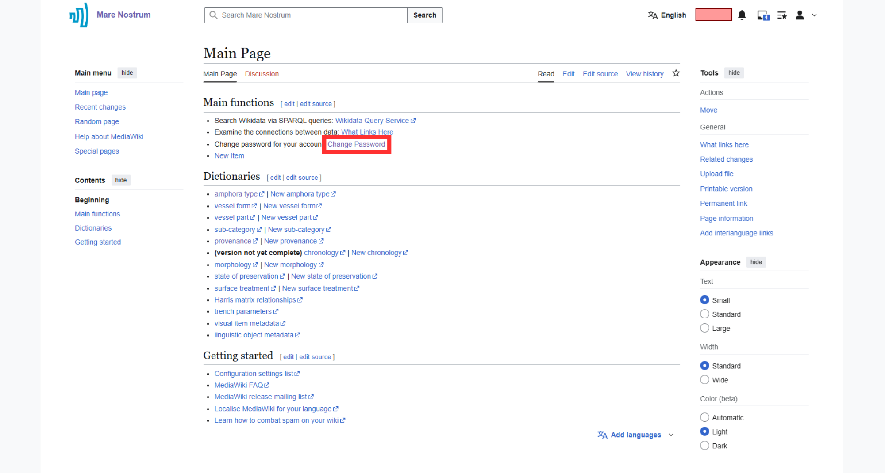
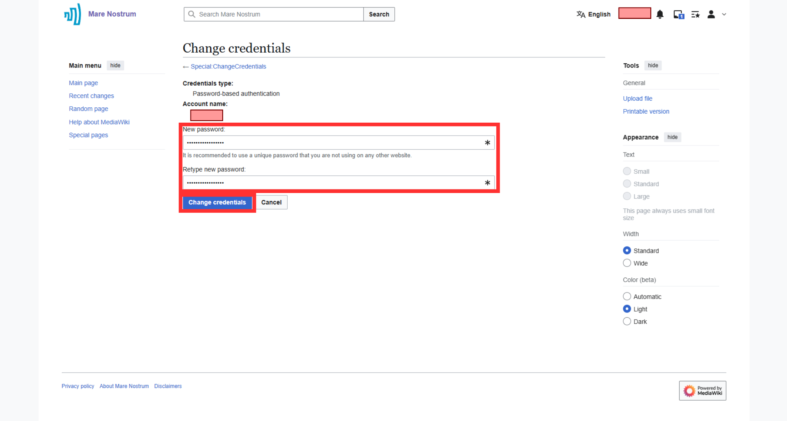
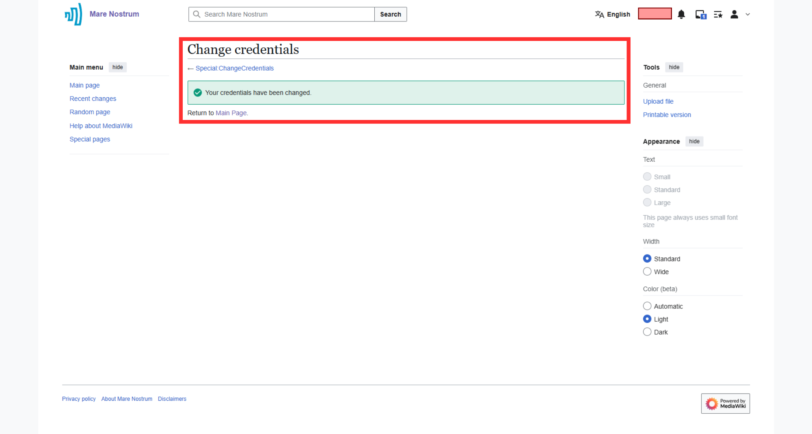

# Account Management

This section provides pieces of information about **logging in to the Thesaurus account** and **changing an account password**.

---

## Logging in to the account

???+ note "Login is required for some activities"
    Note that, there are several actions (e.g., adding and editing contents) that require prior logging in.

1. Find and select the "Log in" button at the top right corner or [click here](https://pac.cenagis.edu.pl/w/index.php?title=Special:UserLogin&returnto=Main+Page).

    

1. Provide your **Username** and **Password** in dedicated fields and press "Log in" button.

    ???+ note  "Remain logged in"
        Enable "Keep me logged in" option to remain logged in after closing the session.

    

    ???+ note "Password reset"
        "Forgot your password?" option does not work, due to the lack of an email protocol connection. For reset, please contact the Thesaurus administrator.
        
1. After completing the procedure, a dedicated page of the logged user is shown. Moreover, in the top right corner, the user's login appears.

    

---

## Changing the password

1. [Log in to the account](#logging-in-to-the-account).

1. Go to the "Change Password" option on the Main page or [click here](https://pac.cenagis.edu.pl/wiki/Special:ChangeCredentials/MediaWiki%5CAuth%5CPasswordAuthenticationRequest).

    

1. Enter your new password, retype it in the required field and press "Change credentials" button.

    

1. Once changed, a confirmation page will be displayed.

    