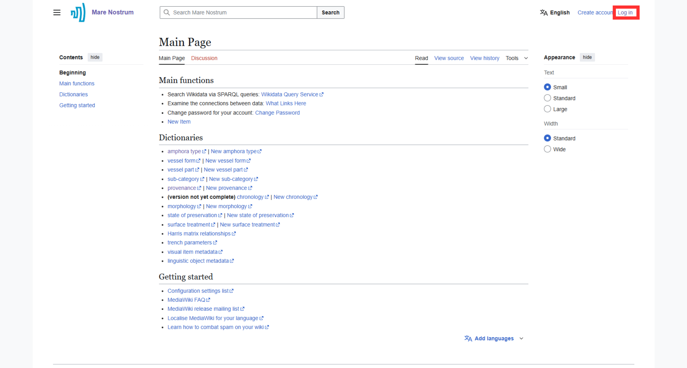
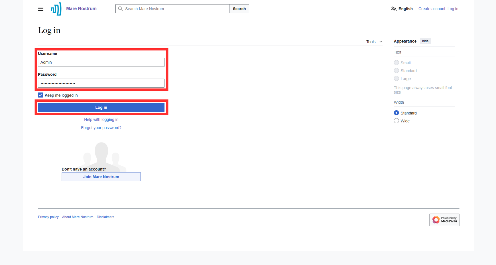

# Account Management

This section provides pieces of information about **logging to the Thesaurus account** and **changing account's password**.

---

## Login to the account

???+ note "Login is required for some activities"
    Note that, there are several actions (e.g., adding and editing contents) that require prior logging in.

1. Find and select "Log in" button in the top right corner of the site or [click here](https://pac.cenagis.edu.pl/w/index.php?title=Special:UserLogin&returnto=Main+Page).

    

1. Provide **Username** and **Password** in dedicated fields and press "Log in" button.

    ???+ note  "Remain logged in"
        Enable "Keep me logged in" option to remain logged in after closing the session.

    

    ???+ note "Password reset"
        "Forgot your password?" option does not work, due to lack of email protocol connection. For changing or resetting the password, please follow [this tutorial](#reset-password).
        
1. On finishing the procedure, a dedicated page of the logged user is shown. Moreover, in the top right corner, user login appears.

    

---

## Reset password