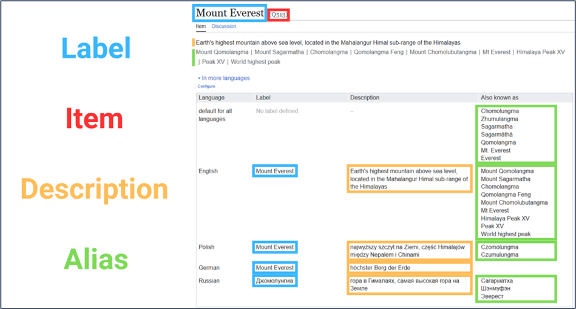
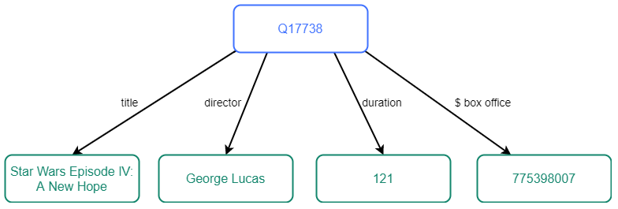
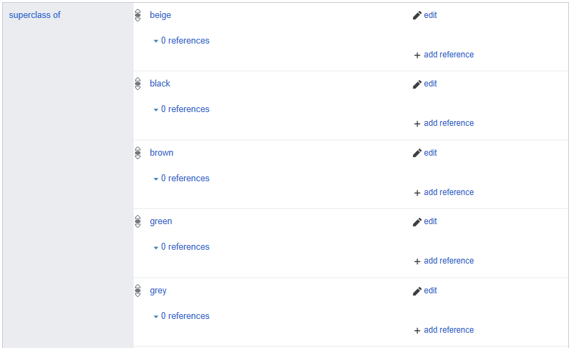

# Appendices

In this section, you can find useful information about:

- [Thesaurus Management System components](#thesaurus-management-system-components)

- [Division of responsibilities between components](#division-of-responsibilities-between-components)

- [Key Terms and Definitions](#key-terms-and-definitions)

- [Object feature storage structure](#object-feature-storage-structure)

- [Properties in hierarchical dictionaries](#properties-in-hierarchical-dictionaries)

- [Inverse properties](#inverse-properties)

- [Important design decisions regarding data modeling](#important-design-decisions-regarding-data-modeling)

---

## Thesaurus Management System components

Dictionary management is provided through four complementary components (click to visit):

1. **[Mare Nostrum Thesaurus](https://pac.cenagis.edu.pl/wiki)** - a dictionary database that stores individual terms organized into thematic categories in a structured format.

    { width="100" style="display: block; margin: 0 auto;" }

1. **[Cradle](https://pac.cenagis.edu.pl/tools/cradle/)** - a tool for adding new dictionary entries to Mare Nostrum Thesaurus.

    { width="100" style="display: block; margin: 0 auto;" }

1. **[Wikibase Query Service (WBQS)](https://pac.cenagis.edu.pl/query/)** - a tool for advanced searching of Mare Nostrum Thesaurus using SPARQL queries.

    { width="100" style="display: block; margin: 0 auto;" }

1. **[QuickStatements](https://pac.cenagis.edu.pl/tools/quickstatements/#/)** - a tool for batch editing and bulk importing data into Mare Nostrum Thesaurus.

    { width="100" style="display: block; margin: 0 auto;" }

---

## Division of Responsibilities Between Components

The table below presents a summary of the division of responsibilities for the tools described in the previous section.

| Tool | Responsibility | Provided Features |
| :--- | :--- | :--- |
| **Mare Nostrum Thesaurus** | A dictionary database that stores data in Linked Data format as an advanced network of interconnections. | - Browsing data - Displaying hierarchical data - Manually adding new dictionary values |
| **Cradle** | A visual graphical editor supporting the addition of new records to the dictionary database via an intuitive interface with a predefined set of required properties for a given thematic set. | - Adding new dictionary values in accordance with the established data model - Adding hierarchically dependent dictionary values |
| **Wikibase Query Service** | An advanced tool for multi-level searching of the dictionary database. Usage requires knowledge of SPARQL syntax as well as the relationships and structures within the Wikidata Mare Nostrum database. | - Browsing data - Thematic filtering of database content - Creating data visualizations |
| **QuickStatements** | A tool for batch editing and bulk importing data into the dictionary database. It allows executing sequence-based commands (CSV/V1 formats) to automate large-scale data modifications. | - Bulk importing and creating new records - Batch adding, modifying, or removing statements and properties - Automated processing of structured datasets |

---

## Key Terms and Definitions

**Item** - a thing, entity or concept. It can be an object, a person, an event, a location, a work of art, or an abstract concept. Items are designated by unique identifiers starting with the letter **"Q"** followed by a positive integer.

**Label** - the primary name of an item in a given language. It provides the essential information needed to identify the topic of the item. Labels do not have to be unique.

**Description** - a short phrase intended to disambiguate items that have identical or similar labels. While descriptions do not need to be unique on their own, two items cannot share both the same label and the same description.

**Alias** - an alternative name for the same item in a given language. It can be a synonym, colloquial name, abbreviation, or historical name. Aliases improve the searchability of items within the database.

---

## Object Feature Storage Structure

Data concerning items (Q) in Mare Nostrum Thesaurus is stored as triplets: item (Q) - property (P) - value, where:

- **Item** - indicates the identifier of the entity it refers to.

- **Property** - defines a relationship or feature of the given item. Each property has an assigned data type that dictates what values can be entered. The list of available properties in the Mare Nostrum Thesaurus project is available [here](https://pac.cenagis.edu.pl/wiki/Special:ListProperties).

- **Value** - represents the actual data associated with the item (it can be another item (Q), a string, a date and time, or geographic point coordinates in the WGS84 system, among others).

Figure below presents a graphical example of the feature storage structure.

*(blue rectangle - **Item**; arrows - **Properties**; green rectangles - **Values**)*

*Image source: [Wikidata Query Service Tutorial](https://wdqs-tutorial.toolforge.org/index.php/introduction/the-structure-of-wikidata/)*

---

## Properties in Hierarchical Dictionaries

- **[subclass of (P2)](https://pac.cenagis.edu.pl/wiki/Property:P2)** - indicates that one object is a subclass or subset of another. It sould not be confused with *instance of (P1)*.

    *Example: A volcano is a **subclass of** mountain; Mount Everest is an **instance of** mountain.*

- **[part of (P20)](https://pac.cenagis.edu.pl/wiki/Property:P20)** - indicates that one item is an integral part of another. This property is mainly used in the *provenance* and *chronology* dictionaries.

Additional properties used in the dictionaries, but **not displayed** in the hierarchical structure:

- **[modified version of (P18)](https://pac.cenagis.edu.pl/wiki/Property:P18)** - indicates that one object is a modified version of another, yet the second object cannot be unambiguously considered identical to the first.

- **[said to be the same as (P17)](https://pac.cenagis.edu.pl/wiki/Property:P17)** - used when there is a need to add two independent items representing the same object under different names, provided the user does not want to declare the second entity as an alias of the first.

---

## Inverse Properties

When manually adding items, it is good practice to add an inverse relationship pointing from the parent item to the child item. Defining this connection is important for efficient navigation between item pages within the hierarchy.

???+ note "Adding a new Item with Cradle"
    Cradle is configured to automatically add a specific inverse property of the declared property.

*Example: If you are adding the item **"beige"**, which is a [subclass of (P2)](https://pac.cenagis.edu.pl/wiki/Property:P2) **"hierarchical color of the soil"**, you should also define the property [superclass of (P11)](https://pac.cenagis.edu.pl/wiki/Property:P11) **"beige"** for the **"hierarchical color of the soil"** item.*

The table below presents the properties used in the Mare Nostrum Thesaurus dictionaries along with their inverses.

| Property | Inverse | Occurrence |
| :--- | :--- | :--- |
| **[subclass of (P2)](https://pac.cenagis.edu.pl/wiki/Property:P2)** | **[superclass of (P11)](https://pac.cenagis.edu.pl/wiki/Property:P11)** | all dictionaries excluding **"provenance"** and **"chronology"** |
| **[modified version of (P18)](https://pac.cenagis.edu.pl/wiki/Property:P18)** | **[has modification(s) (P19)](https://pac.cenagis.edu.pl/wiki/Property:P19)** | mainly **"sub-category"** |
| **[said to be the same as (P17)](https://pac.cenagis.edu.pl/wiki/Property:P17)** | **[said to be the same as (P17)](https://pac.cenagis.edu.pl/wiki/Property:P17)** | all dictionaries |
| **[part of (P20)](https://pac.cenagis.edu.pl/wiki/Property:P20)** | **[has part(s) (P21)](https://pac.cenagis.edu.pl/wiki/Property:P21)** | **"provenance"** and **"chronology"** |

---

## Important design decisions regarding data modeling
