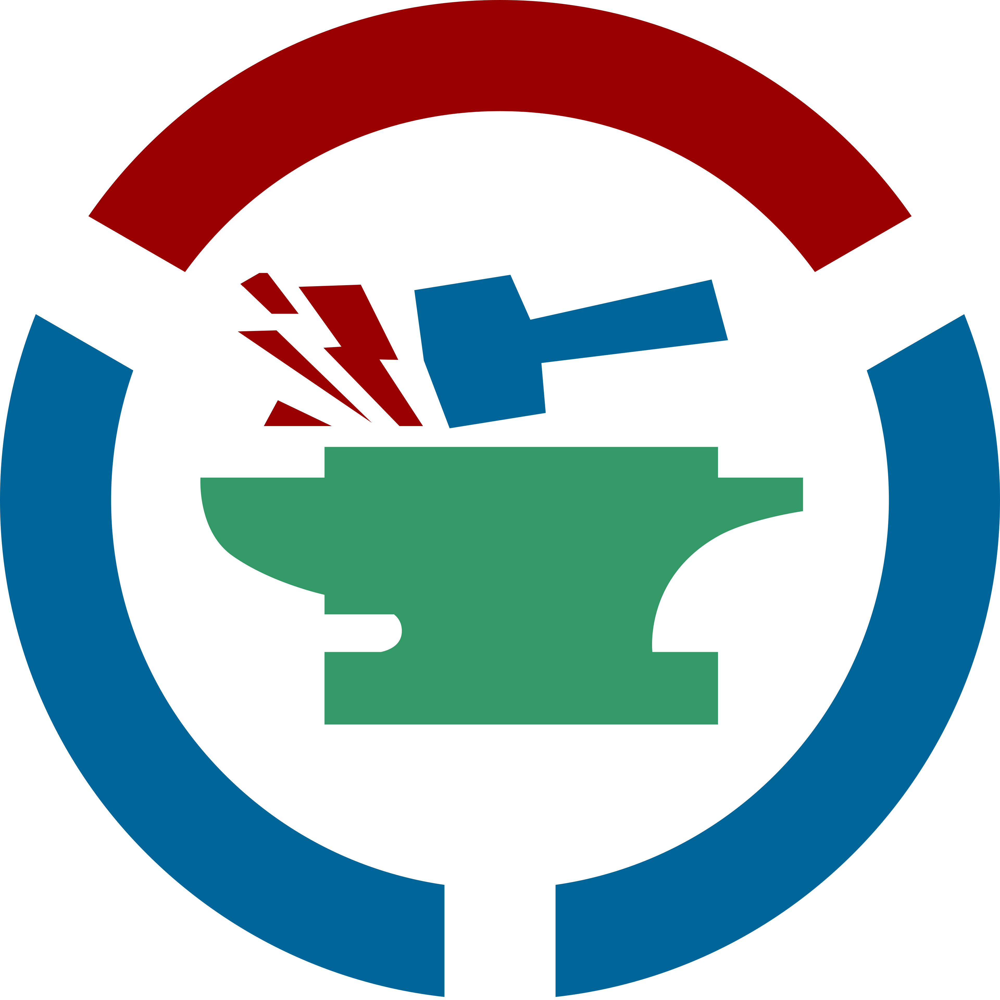
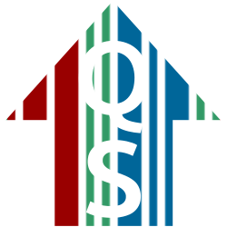

# Appendices

In this section, you can find useful information about:

- [Thesaurus Management System components](#thesaurus-management-system-components)

- [Division of responsibilities between components](#division-of-responsibilities-between-components)

- [Explanation of terms used in this documentation](#explanation-of-terms-used-in-this-documentation)

- [Object feature storage structure](#object-feature-storage-structure)

- [Properties used in the hierarchical dictionaries](#properties-used-in-hierarchical-dictionaries)

- [Inverse properties](#inverse-properties)

- [Important design decisions regarding data modeling](#important-design-decisions-regarding-data-modeling)

---

## Thesaurus Management System components

Dictionary management is provided through four complementary components (click to visit):

1. **[Mare Nostrum Thesaurus](https://pac.cenagis.edu.pl/wiki)** - a dictionary database that stores individual terms organized into thematic categories in a structured format.

    { width="100" style="display: block; margin: 0 auto;" }

1. **[Cradle](https://pac.cenagis.edu.pl/tools/cradle/)** - a tool for adding new dictionary entries to Mare Nostrum Thesaurus.

    { width="100" style="display: block; margin: 0 auto;" }

1. **[Wikibase Query Service (WBQS)](https://pac.cenagis.edu.pl/query/)** - a tool for advanced searching of Mare Nostrum Thesaurus using SPARQL queries.

    { width="100" style="display: block; margin: 0 auto;" }

1. **[QuickStatements](https://pac.cenagis.edu.pl/tools/quickstatements/#/)** - a tool for batch editing and bulk importing data into Mare Nostrum Thesaurus.

    { width="100" style="display: block; margin: 0 auto;" }

---

## Division of Responsibilities Between Components

The table below presents a summary of the division of responsibilities for the tools described in the previous section.

| Tool | Responsibility | Provided Features |
| :--- | :--- | :--- |
| **Mare Nostrum Thesaurus** | A dictionary database that stores data in Linked Data format as an advanced network of interconnections. | - Browsing data - Displaying hierarchical data - Manually adding new dictionary values |
| **Cradle** | A visual graphical editor supporting the addition of new records to the dictionary database via an intuitive interface with a predefined set of required properties for a given thematic set. | - Adding new dictionary values in accordance with the established data model - Adding hierarchically dependent dictionary values |
| **Wikibase Query Service** | An advanced tool for multi-level searching of the dictionary database. Usage requires knowledge of SPARQL syntax as well as the relationships and structures within the Wikidata Mare Nostrum database. | - Browsing data - Thematic filtering of database content - Creating data visualizations |
| **QuickStatements** | A tool for batch editing and bulk importing data into the dictionary database. It allows executing sequence-based commands (CSV/V1 formats) to automate large-scale data modifications. | - Bulk importing and creating new records - Batch adding, modifying, or removing statements and properties - Automated processing of structured datasets |

---

## Explanation of terms used in this documentation

---

## Object feature storage structure

---

## Properties used in hierarchical dictionaries

---

## Inverse properties

---

## Important design decisions regarding data modeling
