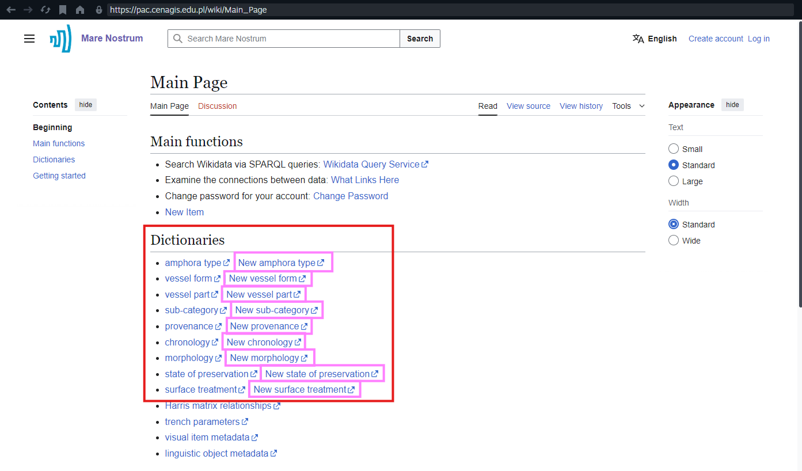
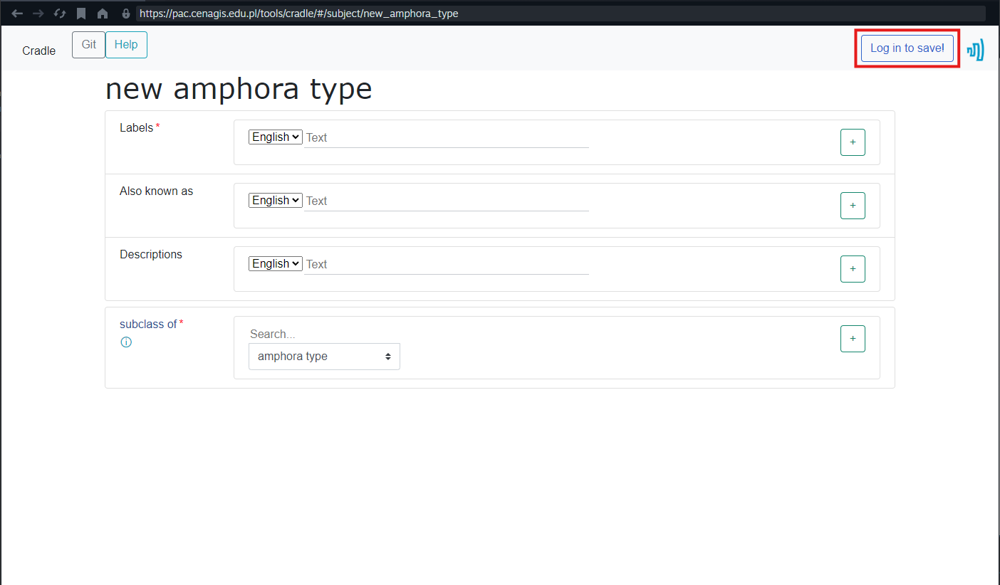
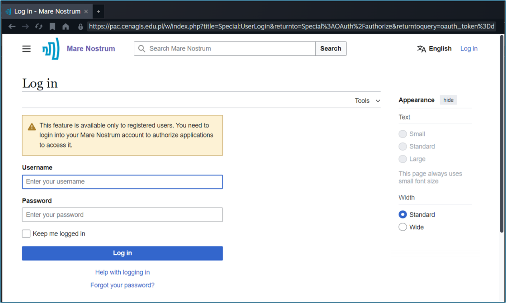
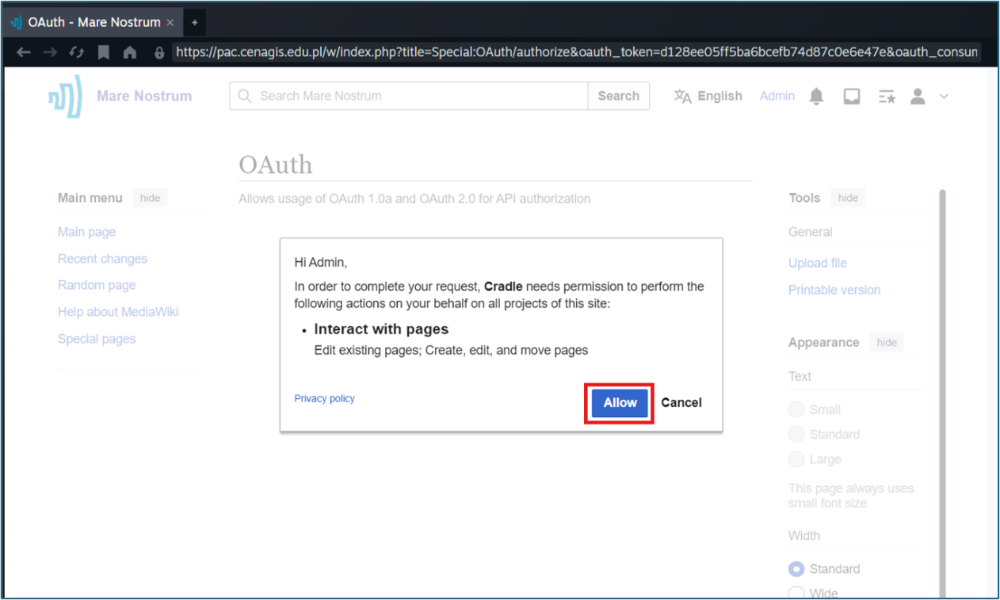
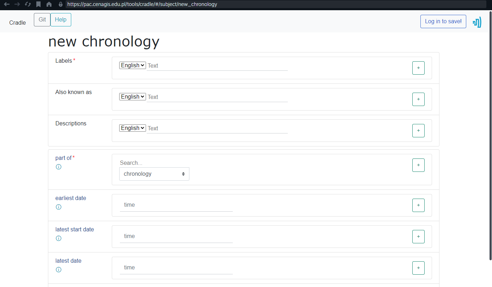
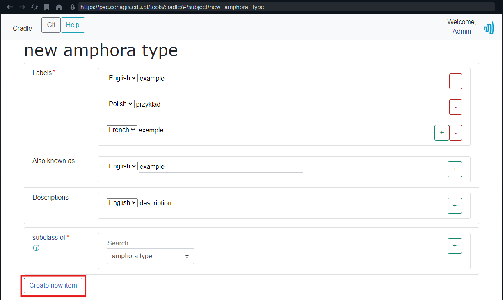
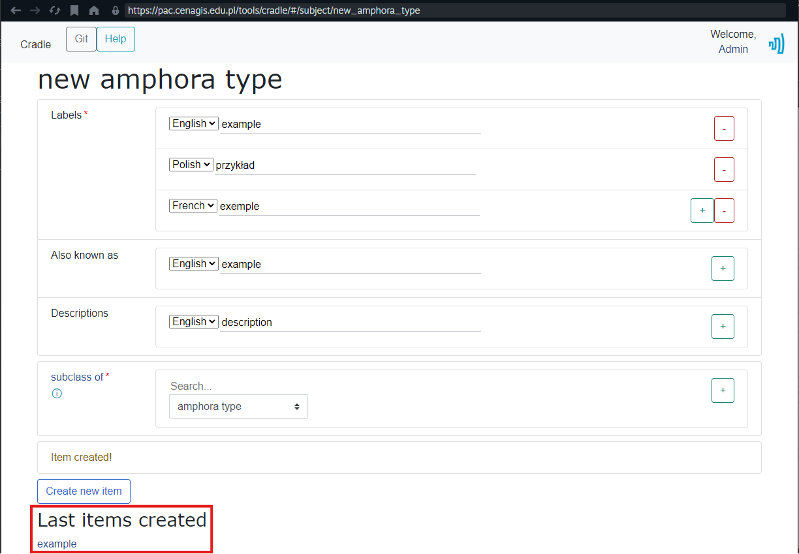
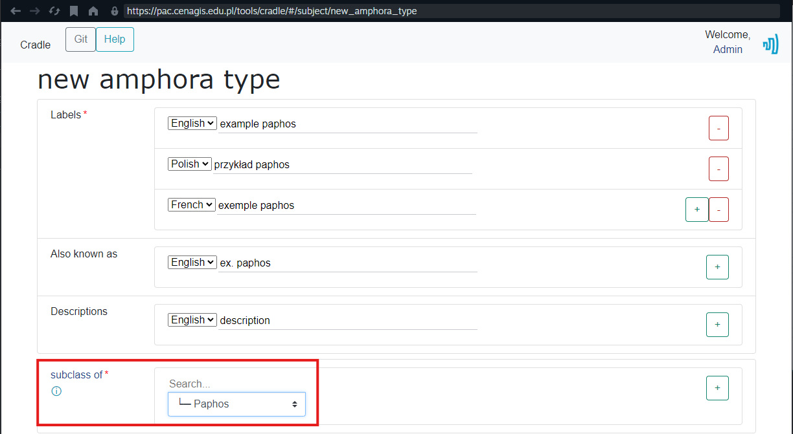

# Creating a New Record in the Thesaurus - Cradle

Cradle is a form-based tool for adding new items to the Mare Nostrum Thesaurus dictionaries. Use it when you need to create a record in a specific dictionary (vessel part, provenance, etc.).

---

## Opening Cradle from the Main Page

1. Go to the [Thesaurus Main Page](https://pac.cenagis.edu.pl/wiki).
1. In the **Dictionaries** section, select a **New [dictionary name]** link (for example, **New amphora type**, **New vessel part**, etc.).

    

---

## Logging In and Authorizing the Tool

Cradle can only save new items after you log in and grant it permission to edit the Thesaurus.

1. On the form page, click **Log in to save!** in the top-right corner.

    

1. Sign in with your Mare Nostrum Thesaurus account.

    

    ???+ note "Account required"
        If you are already logged in, you will not see the login page.
        If you do not have an account yet, follow the steps in [Account Management](account-management.md/#logging-in-to-the-account).

1. On the authorization page, click **Allow** to permit Cradle to make changes on your behalf.

    

After a successful authorization, the form for the selected dictionary becomes ready to fill in.

---

## Form Layout

Each Cradle form has the same core structure. Required fields are marked with a red asterisk (`*`).

1. **Labels** (required) - the name of the new item in the selected language.
1. **Also known as** (optional) - alternative names (aliases) in the selected language.
1. **Descriptions** (recommended) - a short description in the selected language that distinguishes the item from similar ones.
1. **Subclass of/Part of** (required) - the parent item that places the new record in the dictionary hierarchy.
1. **Additional properties** - dictionary-specific fields. Whether they are required depends on the particular dictionary.

Important interface elements:

* **Language selector** - a dropdown before each text field in **Labels**, **Also known as**, and **Descriptions**. Choose the appropriate language for the label, description, or alias you are entering.
* **Add (+) and remove (-) buttons** - visible after each text field. Click `+` to add another entry in a different language (pick the language in the dropdown first); click `−` to remove an extra language entry.
* Hover over the `ⓘ` icon next to a property to see its definition.
* Click the Mare Nostrum logo in the top-right corner to return to the Main Page.

???+ note "Language"
    Enter the primary label in English. To add labels, descriptions, or aliases in other languages, use the language selector and the `+` button next to the relevant field.
    Available languages: English (EN), Polish (PL), Greek (EL), German (DE), French (FR).

Example form showing described above elements and its dictionary-specific fields

---

## Filling In and Submitting the Form

1. Complete all required fields (marked with a red asterisk).
1. Fill in optional fields as needed for the dictionary you are editing.
1. When the required fields are complete, the **Create new item** button appears at the bottom of the form.

    ???+ tip "Button not visible?"
        If required fields are filled but **Create new item** still does not appear, click anywhere outside the currently focused field to refresh the form state.

    

1. Click **Create new item**.
1. Wait while the page shows **Creating item...**
1. When creation succeeds, the **Last items created** section appears with a link to the new item.

    

Open the link to review the new record and, if needed, continue editing it on the item page.

---

## Creating a Subtype of an Existing Item

By default, the **subclass of/part of** field points to the main parent of the dictionary. You can instead choose the new item under another existing dictionary entry.

For example: add **example paphos** as a subtype of **paphos**, rather than directly under **amphora type**.

1. Open the Cradle form for the target dictionary.
1. In the **subclass of/part of** field, replace the default parent with the existing item that should be the direct parent.
1. Complete the remaining required fields and click **Create new item**.

    