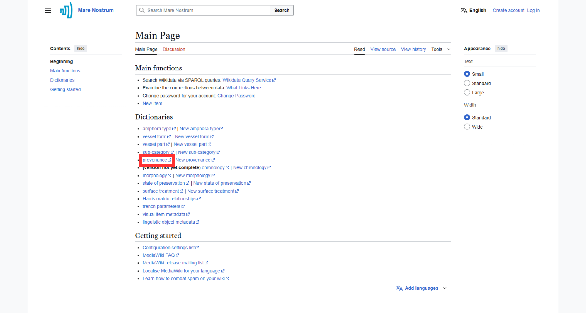
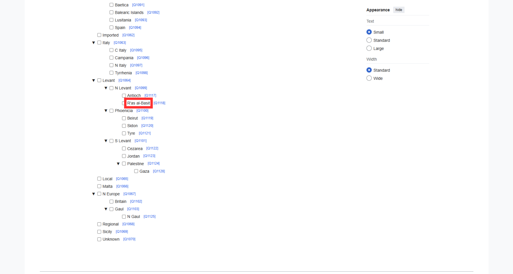
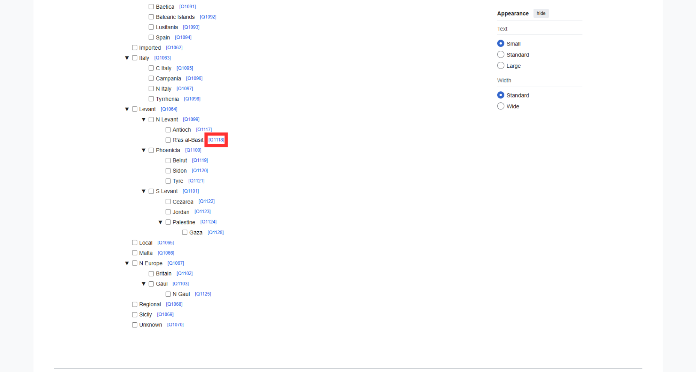
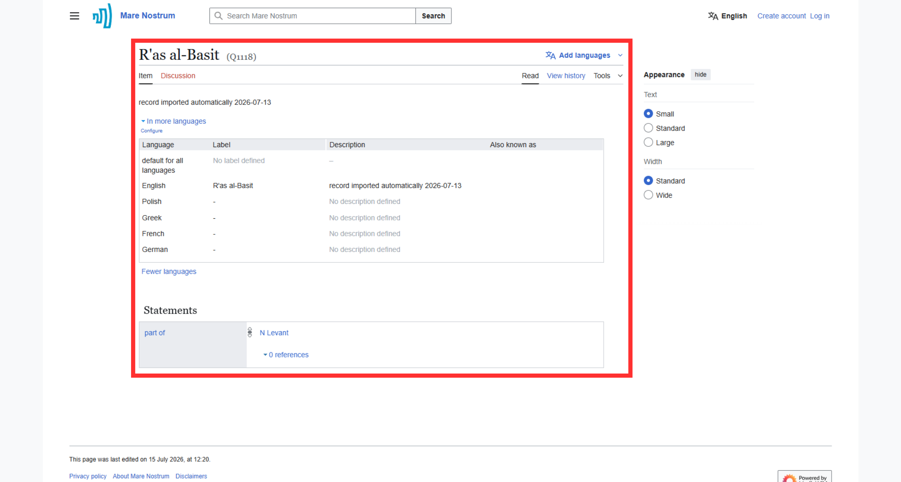
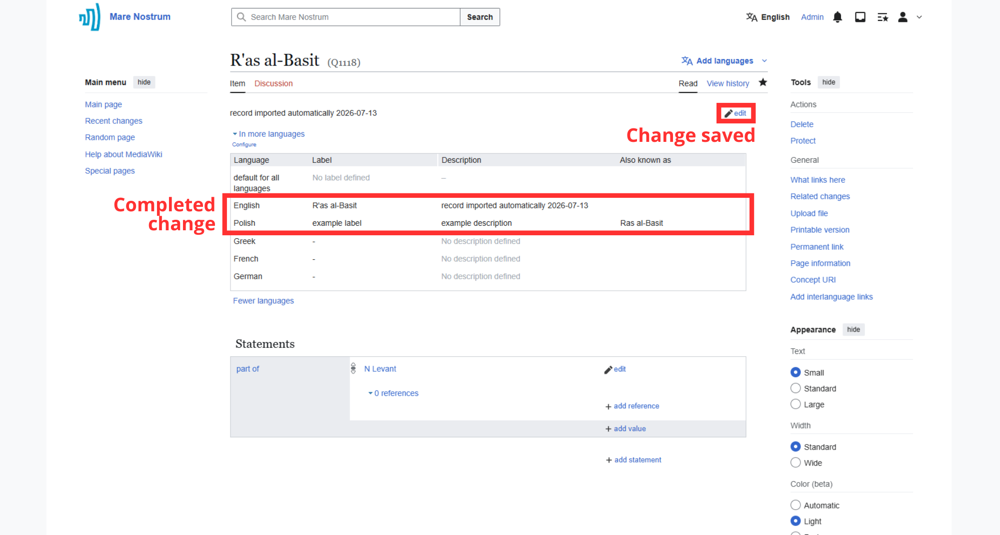
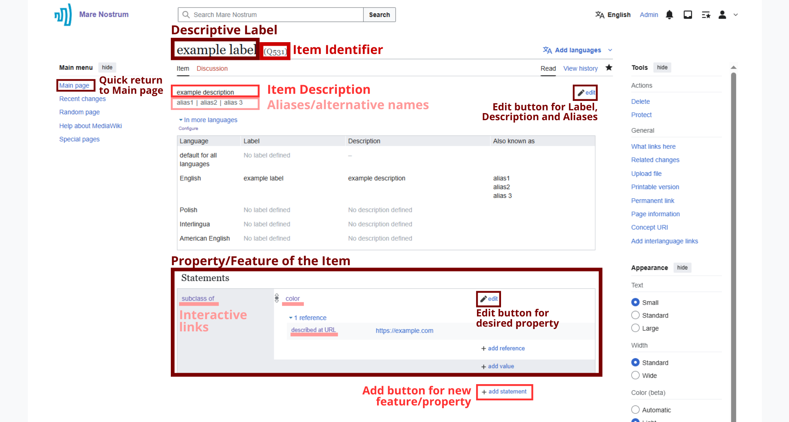

# Thesaurus Management Documentation

For code repository visit [Mare Nostrum LAB GitHub](https://github.com/Mare-Nostrum-Lab-UJ) (currently not committed).

---

## Quick Start

### Browsing Thesaurus

1. Go to the [Thesaurus](https://pac.cenagis.edu.pl/wiki) main page.
1. Click on the desired dictionary (e.g., Provenance).

    

1. Navigate to the record of interest (e.g., R'as al-Basit).

    

    ???+ note
        At this point, user can inspect relations between available items.

1. Inspect a record of interest by clicking on the internal blue identifier of a subject.

    

1. After clicking, Thesaurus opens the site associated with the selected record.

    

---

### Editing Contents

1. [Browse Thesaurus](#browsing-thesaurus) for subject.
1. Click on the "edit" button with pencil icon.

    ???+ note "Login before editing"

        Editing contents requires prior logging in. Further instructions [here](account-management/#logging-in-to-the-account).

    

1. Modify contents and press "save" after completing the change.
    
    

1. Wait for changes to be saved which is indicated by the return of "edit" button.

    

    ???+ note "Modifiable elements and non-modifiable elements"
        
        **User can modify:**

        - Descriptive Label,
        - Item Description,
        - Aliases/alternative names,
        - Labels, Descriptions and Aliases in different languages

            _(available: English (EN), Polish (PL), Greek (EL), German (DE), French (FR))_

        - Properties of an Item:
            - To modify content of existing property use second "edit" button with pencil icon.
            - To add new property, select "add statements" with plus icon, choose desired property (List of properties)

        **User cannot modify:**
        
        - Item Identifier (Q followed by a number).

---

### Adding New Content
1. **Selecting the Target Dictionary**

    On the "Main page" in the "Dictionaries" section, there are links to create a new item formatted as "New" alongside the English name of the dictionary.

2. **Login and Tool Authorization**

    The tool requires authorization, which is initiated via the "Log in to save!" button in the top right corner of the form.

    ???+ note
        You will be redirected to the Mare Nostrum Wiki login page, and then to the OAuth page, where authorization is granted by clicking the "Allow" button at the bottom of the message.

    ???+ note
        OAuth authorization requires prior [login](account-management/#logging-in-to-the-account).

3. **Filling in Data**

    - **Labels (required)** – the name of the item being added in English,

    - **Also known as** – alternative names for the item,

    - **Descriptions** – a short description of the item to distinguish it from others,

    - **Subclass of** – the parent element for the item being added.

4. **Saving**

    Once filled out correctly, the "Create new item" button will appear at the bottom of the page. This initiates saving the item to the database.

    During the save process, a "Creating item..." message will be displayed. Upon successful creation, the "Last items created" section will appear at the bottom of the page with a link to the newly added item.

---

### Elements of the Item site

