# Mare Nostrum Thesaurus - Management

This section is dedicated to explain all specific procedures which allow searching, modifying and deleting information from the Mare Nostrum Thesaurus.

---

## Browsing Dictionaries

### Available Data

The Mare Nostrum Thesaurus project offers the following data dictionaries (click to explore):

- [**amphora type**](https://pac.cenagis.edu.pl/wiki/AmphoraTypeDictionary) - hierarchical Mediterranean amphora types

- [**vessel form**](https://pac.cenagis.edu.pl/wiki/VesselFormDictionary) - general morphological categories

- [**vessel part**](https://pac.cenagis.edu.pl/wiki/VesselPartDictionary) - preserved component part of a vessel

- [**sub-category**](https://pac.cenagis.edu.pl/wiki/Sub-categoryDictionary) - detailed product specification (primarily refers to the ceramic fabric/paste, which sometimes implies a specific repertoire of vessel types)

- [**provenance**](https://pac.cenagis.edu.pl/wiki/ProvenanceDictionary) - hierarchical dictionary of vessel production sites

- [**chronology**](https://pac.cenagis.edu.pl/wiki/ChronologyDictionary) - hierarchical timeframes

- [**morphology**](https://pac.cenagis.edu.pl/wiki/MorphologyDictionary) - geometric characteristics of fragments

- [**state of preservation**](https://pac.cenagis.edu.pl/wiki/StateOfPreservationDictionary) - state of preservation of a found fragment

- [**surface treatment**](https://pac.cenagis.edu.pl/wiki/SurfaceTreatmentDictionary) - type of exterior wall finishing

- [**Harris matrix relationships**](https://pac.cenagis.edu.pl/wiki/HarrisMatrixRelationshipsDictionary) - stratigraphic relationships according to the Harris matrix (describing chronological and spatial links between stratigraphic units)

- [**trench parameters**](https://pac.cenagis.edu.pl/wiki/TrenchParametersDictionary) - parameters defining the physical, material, and methodological characteristics of an archaeological trench. This includes:

    - **archaeological remains** - types of recovered artifacts and materials

    - **context characterization** - physical properties of the excavated layer, including its origin, soil color, grain size, and soil density

    - **excavation procedures** - methods applied during the excavation of the trench

- [**visual item metadata**](https://pac.cenagis.edu.pl/wiki/VisualItemMetadataDictionary) - visual object metadata, regarding drawing and image

- [**linguistic object metadata**](https://pac.cenagis.edu.pl/wiki/LinguisticObjectMetadataDictionary) - textual and linguistic attributes assigned to an object

---

### Searching for a Specific Value

1. If you know the specific record you are looking for, enter it in the dedicated panel located at the top of the interface.

    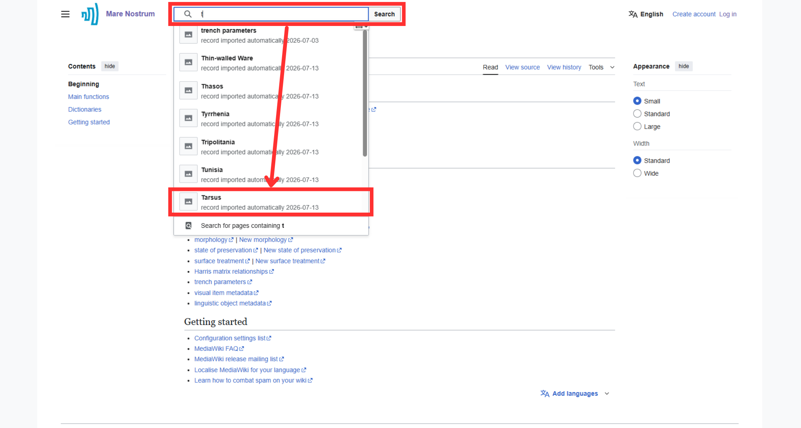

2. Clicking on an item redirects you to its content, displaying all defined properties.

    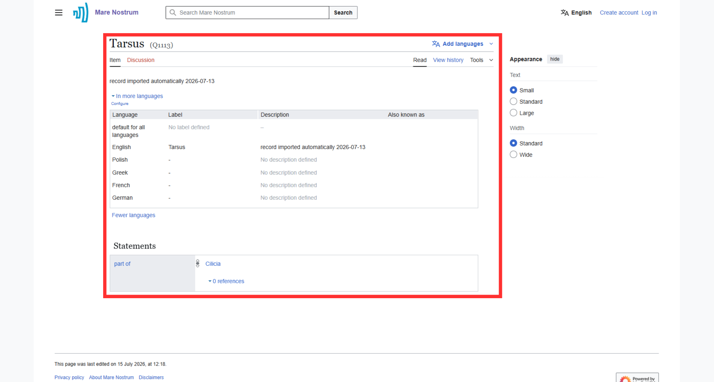

---

### Displaying and Searching Hierarchical Data

???+ note "Dictionaries structure"
    Each dictionary is represented by a drop-down list that can be opened by clicking the corresponding link name or by clicking the corresponding dictionary name in the [Available Data](#available-data) subsection.

1. Select a [dictionary](#available-data) of interest.

    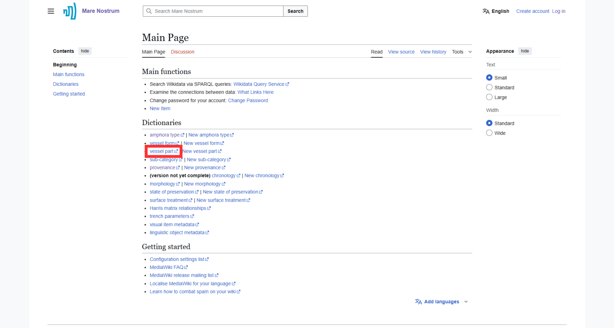

1. After selecting, an expandable view of the object hierarchy linked to the parent item is displayed (e.g., vessel part).

    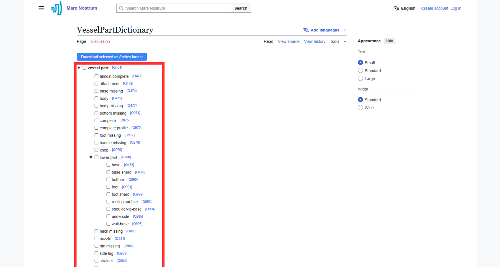

1. To display a specific dictionary value, click on the blue **"Q"** identifier followed by a corresponding number.

    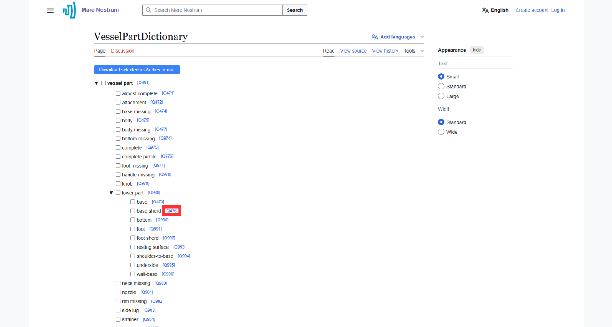

---

## Modifying Dictionaries

### Manually Adding a New Item

???+ note "Log in before adding"
    Adding a new item requires [logging in](account-management.md/#logging-in-to-the-account) first.

1. Select the **"New item"** option from the Main page.

    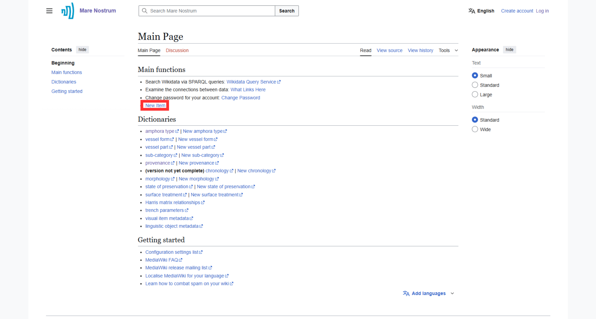

1. Enter the Label and Description. If aliases exist, they should also be provided here. Complete the process by clicking the **"Create"** button.

    ???+ note "Language"
        Pay close attention to the Language field while adding an item, as an unintentional change may result in incorrect value assignment.

    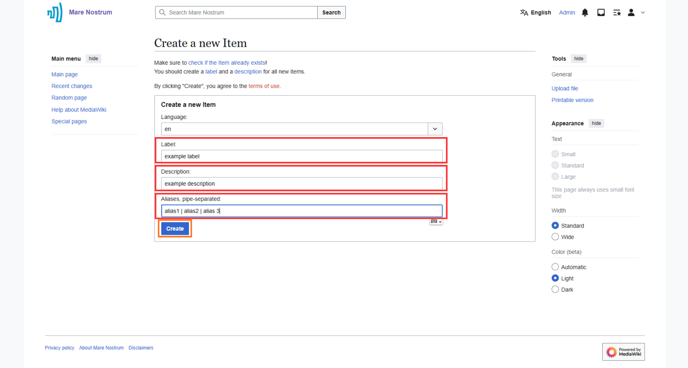

1. After creating the item, its page will appear on the screen, allowing you to verify the accuracy of the entered data and perform potential edits by clicking the **"edit"** button.

    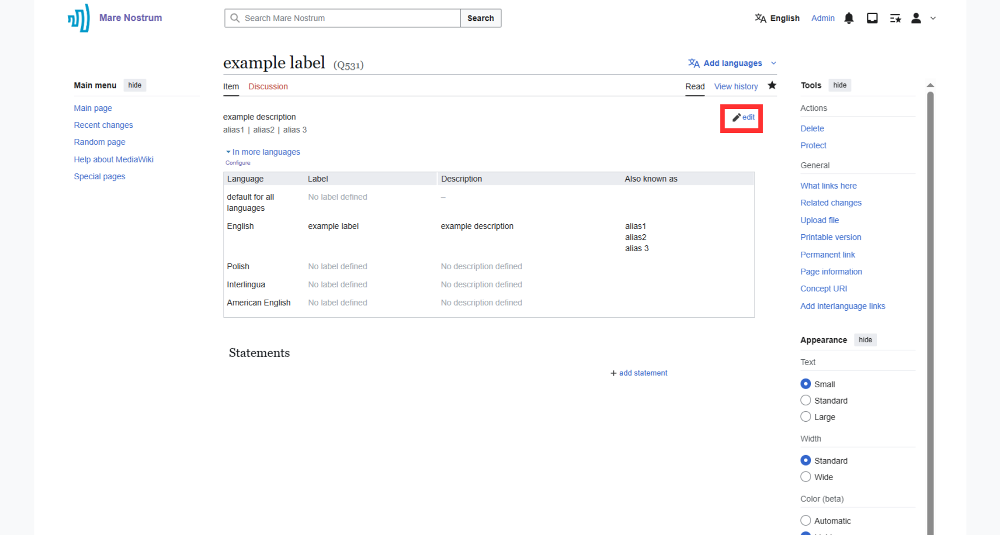

1. If the label, description, and aliases are correct, you typically need to define statements pointing to the properties (P) of the item. This is done using the **"add statements"** button.

    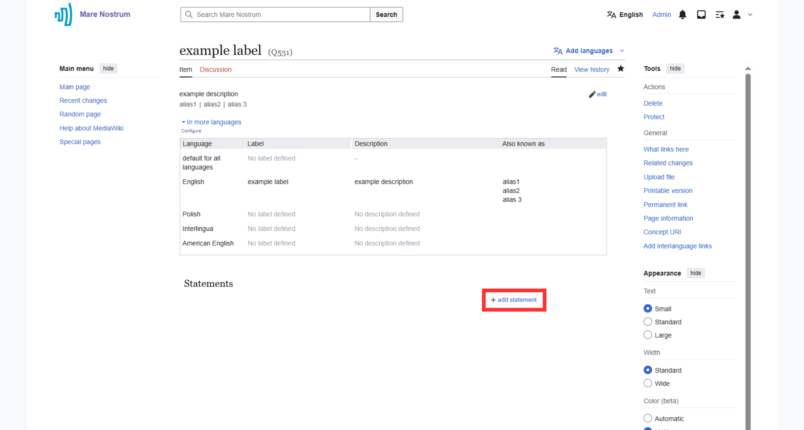

1. To add a new statement, follow steps below:
    
    - 1 - Enter the appropriate property by its name.
    
    - 2 - Provide the value representing the given feature.
        
        ???+ note "Matching types"
            Ensure that the added value type matches the property type.

    - *2a (optional) - Add a **"reference"** indicating the source of the information. Suggested property: [described at url (P29)](https://pac.cenagis.edu.pl/wiki/Property:P29).*
    - *2b (optional) - Assign a value to the selected property.* 
        
        ???+ note "Matching types"
            Ensure that the added value type matches the property type.

    - 3 - Save the statement for the item.

    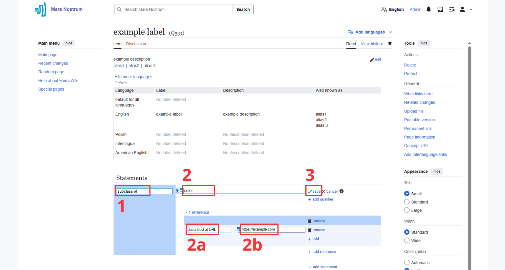

1. After saving the statement, you can assign another value to it ("add value") or create a new statement poining to the item (**"add statement"**).

    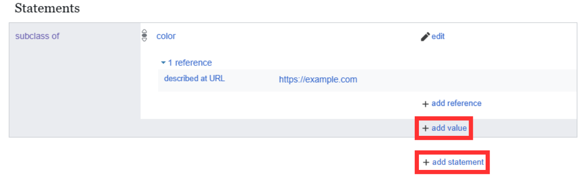

---

### Editing an Existing Item

1. [Browse dictionaries](#browsing-dictionaries) for the item of interest (e.g., R'as al Basit).

1. Click the **"edit"** button with pencil icon.

    ???+ note "Log in before editing"
        Editing an item requires [logging in](account-management.md/#logging-in-to-the-account) first.

    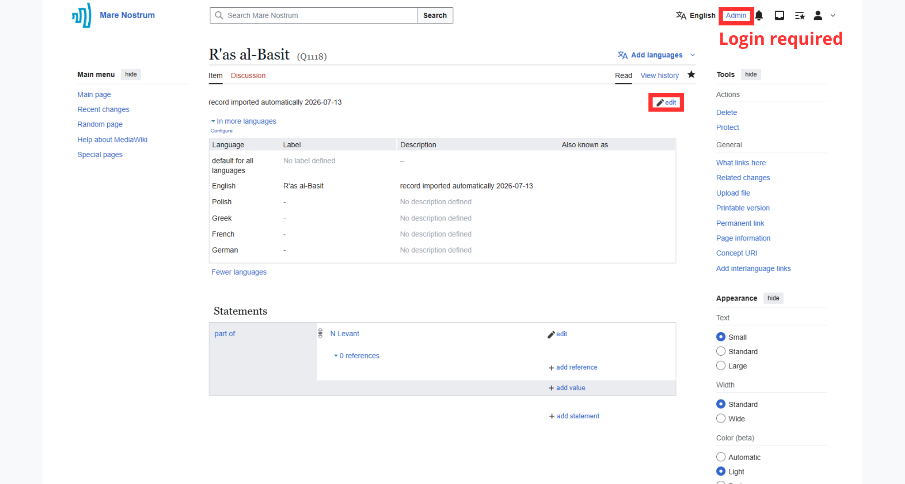

1. Modify contents and press **"save"** after completing the change.
    
    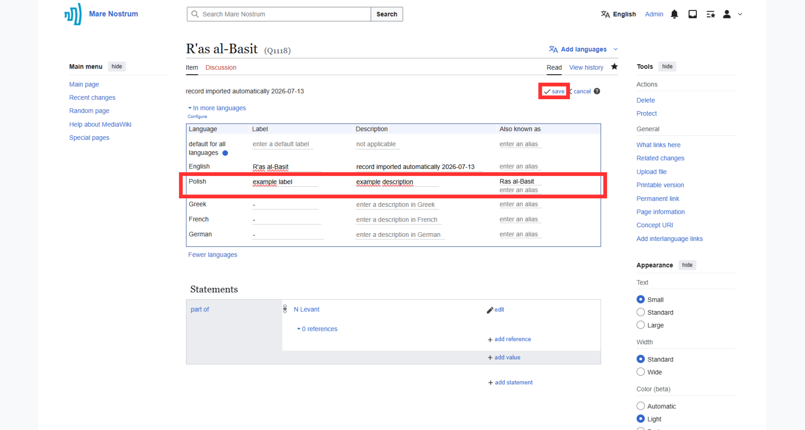

1. Wait for changes to be saved which is indicated by the reappearance of the **"edit"** button.

    

---

### Deleting an Item

???+ note "Retrievable Data Loss"
    This action is not permanent, and the data can be undeleted.

???+ note "Log in before deleting"
    Deleting an item requires [logging in](account-management.md/#logging-in-to-the-account) first.

1. [Browse dictionaries](#browsing-dictionaries) to find the item you want to delete.

2. (optional) Make sure that the **"Tools"** pane is displayed on the right side of the selected page. If not, find the **"Tools"** menu in the upper-right corner of the main content area, expand it, and select the **"move to sidebar"** option.

    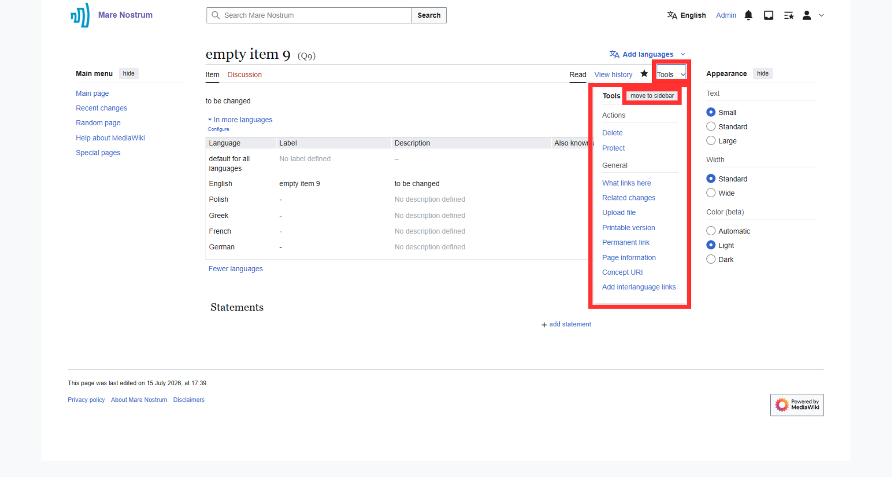

3. In the **"Actions"** section of the **"Tools"** pane, select **"Delete"**.

    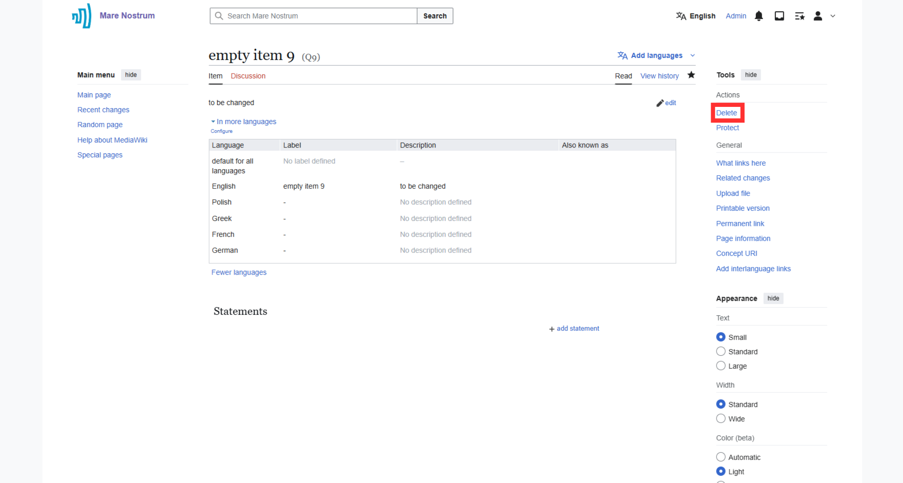

4. If needed, select a deletion reason from the dropdown menu and provide additional details in the text field (if not, leave the default values). Then, click **"Delete page"** to remove the item from the Thesaurus.

    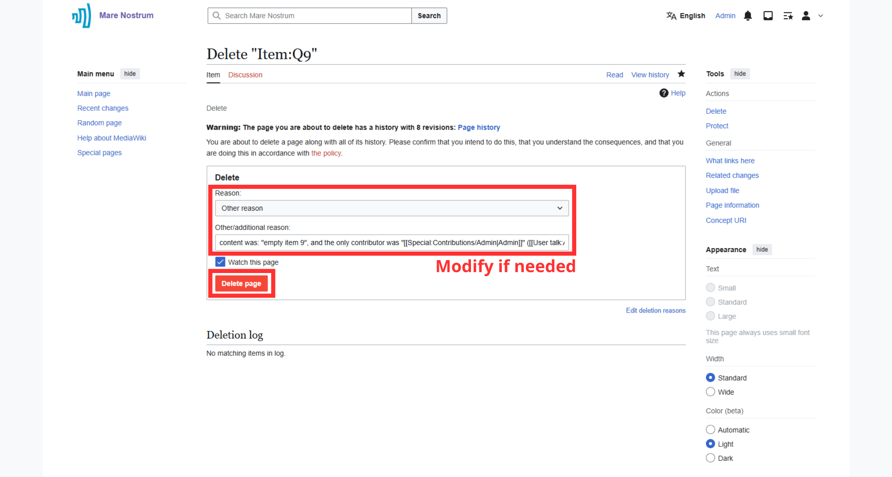

5. After deletion, a confirmation message will be displayed.

    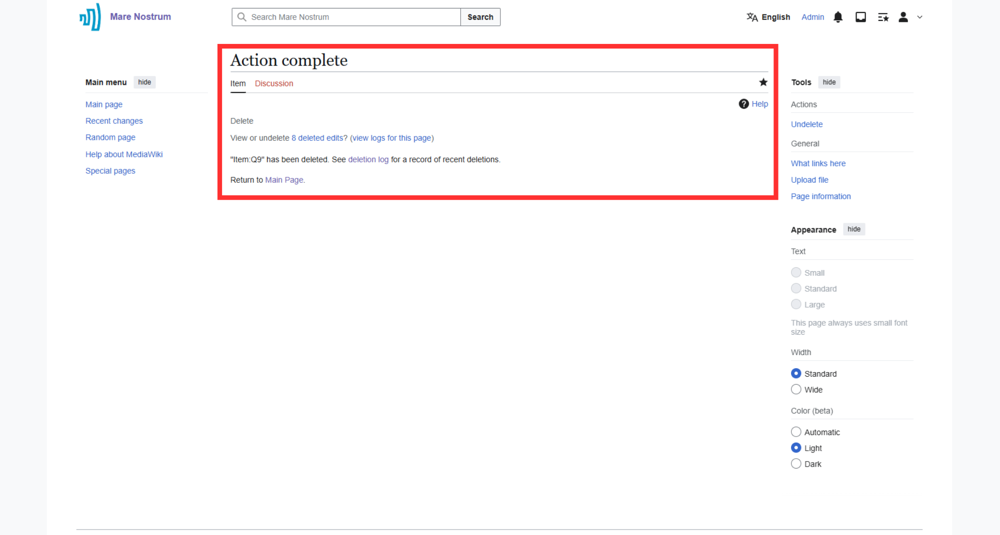