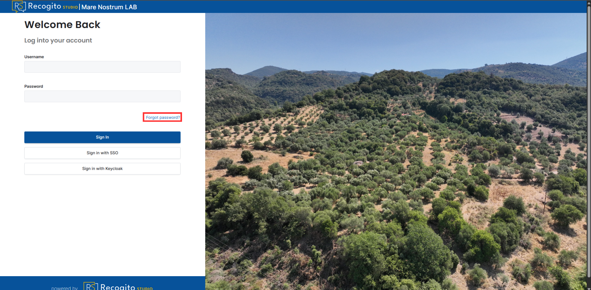
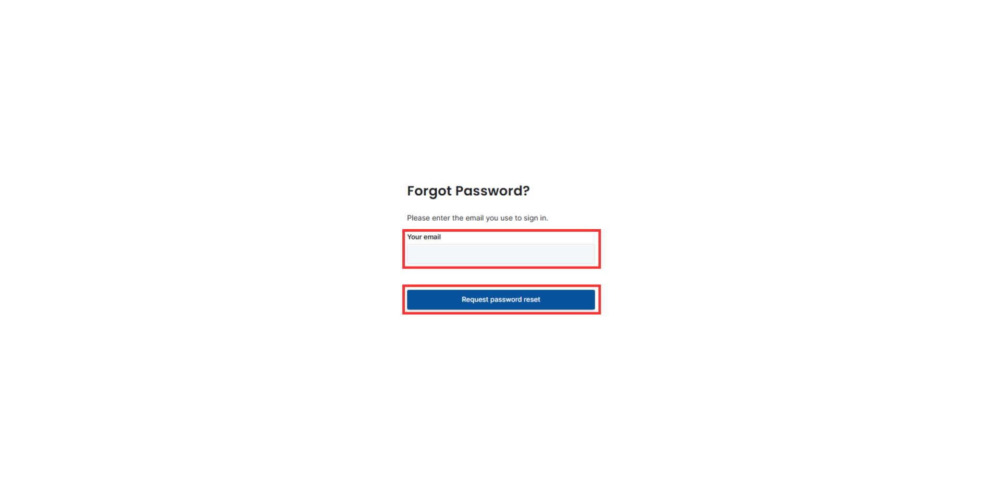
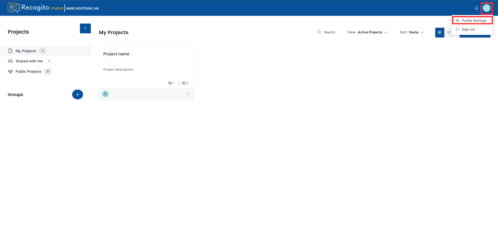
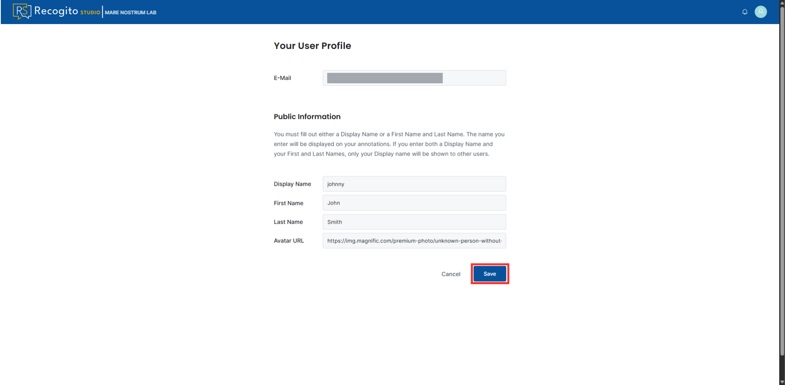
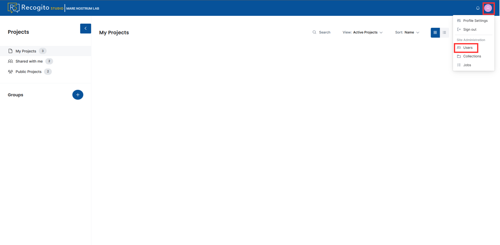
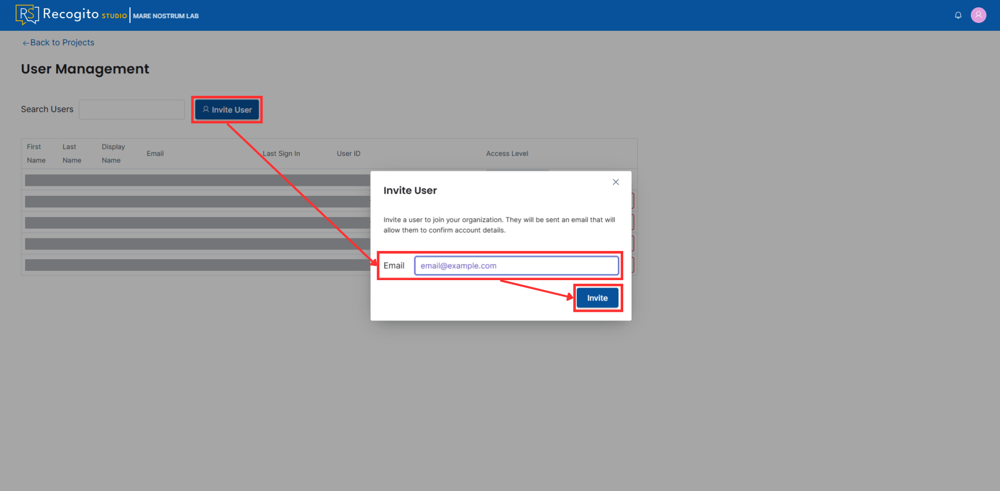
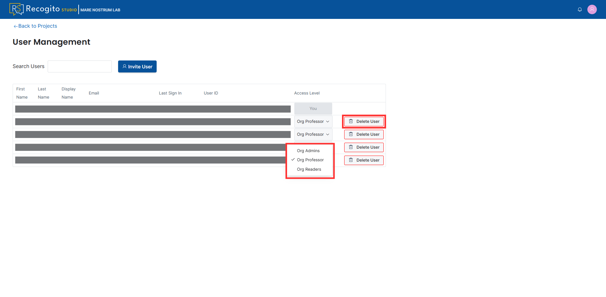

# Account Management

This section provides information on **logging in to the Recogito Studio MN account**, **resetting an account password**, **changing profile settings**, **inviting new users** and **managing users and their priviledges**.

---

## Login to Recogito Studio

1. Visit the `recogito.mn.cenagis.edu.pl` website or click [here](https://recogito.mn.cenagis.edu.pl/en/sign-in).

1. Provide your **Username** and **Password**, then click the **"Sign In"** button.

    

---

## Reset an Account Password

???+ note "Password reset"
    To reset a password to the Recogito Studio MN, you must have logged in to the platform at least once and already have an existing account.

1. Visit the `recogito.mn.cenagis.edu.pl` website or click [here](https://recogito.mn.cenagis.edu.pl/en/sign-in).

1. Click the **"Forgot password?"** option.

    

1. Provide your email address and submit the reset request.

    

1. Wait for the email and follow the instructions provided.

    ???+ note "Check spam folder"
        If you do not receive the email, check your spam folder. If there is no message, contact the page administrators.

---

## Change Profile Settings

1. Click on your profile icon.

1. Click **"Profile Settings"** option.

    

1. Provide personal data. For the avatar URL, paste a Web link to the image.

    ???+ note
        It is suggested that the link ends with an image format suffix (e.g., *.jpg, *.png).

    

---

## Inviting New Users

???+ note "User priviledges"
    To invite new users, you need to have `Admin` organization role.

1. Click on your profile and go to the **"Users"** section.

    

1. Press the **"Invite User"** button, provide the email you want to invite to the organization, and send the invitation.

    

1. Further information for the invited user is provided in the invitation email.

---

## Managing Users and Their Priviledges

???+ note "User priviledges"
    To manage users, you need to have `Admin` organization role.

1. Click on your profile and go to the **"Users"** section.

    

1. Here, you can inspect information about users, such as First, Last and Display Name, Email, Last Sign In, and User ID. Moreover, you can delete users from the organization and change their [Access Level]().

    