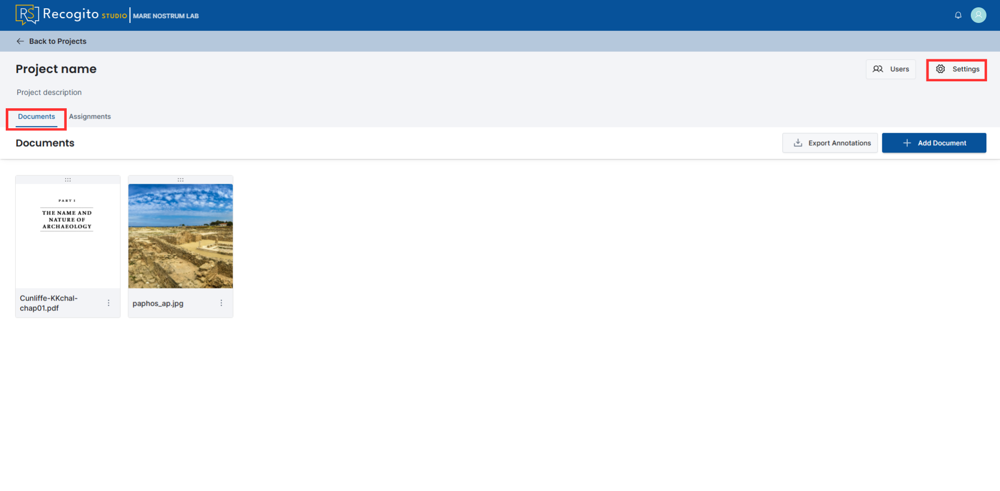
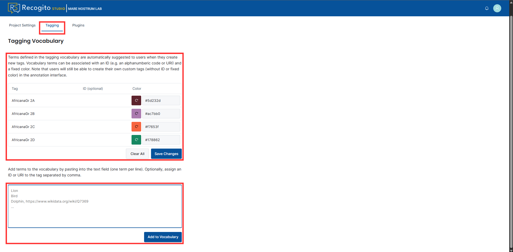

# Appendices

In this section, you can find useful information about:

- [Recogito Studio Roles](#recogito-studio-roles)
- [Annotating TEI Documents with Images](#annotating-tei-documents-with-images)
- [Tagging Vocabulary](#tagging-vocabulary)

---

## Recogito Studio Roles

Recogito natively has two permission levels:

### Organization Level Roles

1. **Org Administrator**

    - Can see all projects
    - Can create new projects and add documents to all projects
    - Can browse and annotate documents across all projects
    - Can edit and delete any annotations, document, or entire project
    - Manages users (invites new ones, removes existing ones, changes roles)

2. **Org Professor**

    - Can create new projects
    - Does not have access to other people's projects (unless invited)
    - Can add annotations in the projects they belong to

3. **Org Reader**

    - By default, only sees projects they are a member of
    - Cannot create their own projects
    - Receives invitations to specific projects

### Project Level Roles

1. **Project Administrator**

    - Adds and removes documents within the project
    - Can browse and annotate documents within the project

2. **Project Student**

    - Dedicated access for completing tasks within the project

---

## Annotating TEI Documents with Images

To successfully render images within a TEI text, the document must reference images via accessible Web URLs rather than local paths. If paths are hardcoded, Recogito Studio will fail to load them, preventing the images from displaying.

---

## Tagging Vocabulary

You can pre-define a list of tags that will be included in the document by following the steps below:

1. Open a project, go to the **"Documents"** tab, and click the **"Settings"** button.

    

2. Go to the **"Tagging"** tab, provide your list of tags, click **"Add to Vocabulary"**, customize the tags, and save the changes.

    