# Main Activities

This section provides information on:

- creating a new project,
- adding a new document,
- modifying document metadata, 
- creating a group,
- annotating TEI texts or PDF documents,
- annotating IIIF, JPG or PNG images,
- installing Geotagger plugin in your project,
- using Geotagger plugin,
- creating an assignment,
- fulfilling an assignment.

---

## Create a New Project

???+ note "User priviledges"
    To create a new project, you need to have a proper organization role, which means having a `Professor` or `Admin` role. Further information can be found [here]().

1. [Login to Recogito Studio](account-management.md/#login-to-recogito-studio).

1. Press the **"New Project"** button in the top right corner of the page.

    

1. Provide the project name and description, set projects properties, and press the **"Create"** button.

    ???+ note "Project properties - Project Visibility"
        You can select two options in Project Visibility section:

        - **Private** - project is visible only to the admin and users who join after receiving an admin invitation.
        - **Public** - any registered user can access the project by visiting the **"Public Projects"** section.

    ???+ note "Project properties - Project Type"
        You can select two options in Project Type section:

        - **Assignments** - project admins create assignments with specific documents, and team members fulfil the given tasks.
        - **Single Team** - project members can annotate any document.

    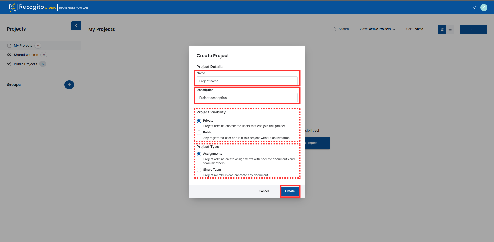

1. Upon creation, an empty project page will be displayed. 

    

---

## Add New Document

1. [Create](#create-new-project) or open a project.

1. Press the **"Add Document"** button in the top right corner.

    

1. Press the **"Import"** button and select a file from your device or provide a IIIF manifest.

    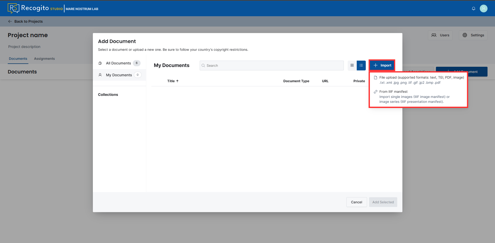

1. (Optional) Go to the **"All documents"** section and select documents of interest from the list of publicly available ones across the organization.

    

1. Wait for processing, which ends with a confirmation message and a new document object.

    ???+ note
        To inspect the document from the adding panel, you need to refresh the page by hand.

    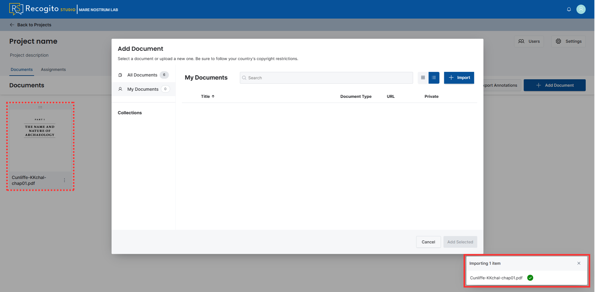

---

## Modify Document Metadata

### Method 1

1. Open a project, click the three dots in the object representing the document, and click **"Edit document metadata"**.

    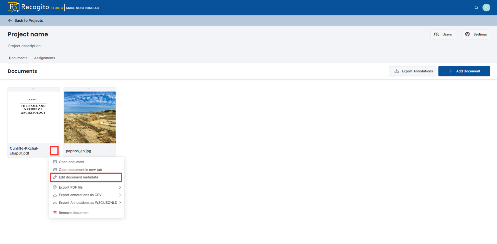

1. Add or modify document's metadata and save the changes.

    ???+ note
        Here, you can also change a name of the file in the Recogito Studio.

    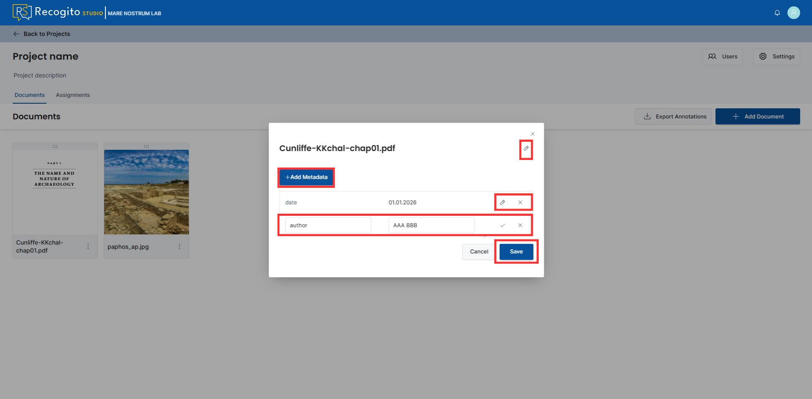

---

### Method 2

1. Open a project, click the "Add Document" button, and click three vertical dots next to the document of interest.

    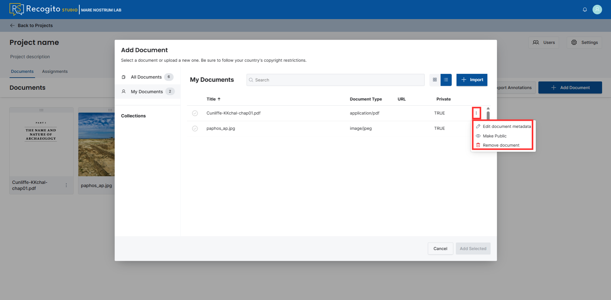

1. Here you can edit document metadata (see point 2 in **[Method 1](#method-1)**), change its status, or remove it from Recogito Studio.

    ???+ note "Make Public / Make Private"
        This option allows the user to change document accessibility. If status is `Private`, only users inside a specific project can see this document. If status is `Public`, any logged-in user can access this file via the **"All Documents"** section.

---

## Create a Project Group

???+ note "Groups"
    A **Group** is a dedicated tool allowing users to thematically aggregate projects (e.g., by source, year, or place).

1. On the main page, click the **"+"** button next to the **"Groups"** section, provide a name, and click the **"Create"** button.

    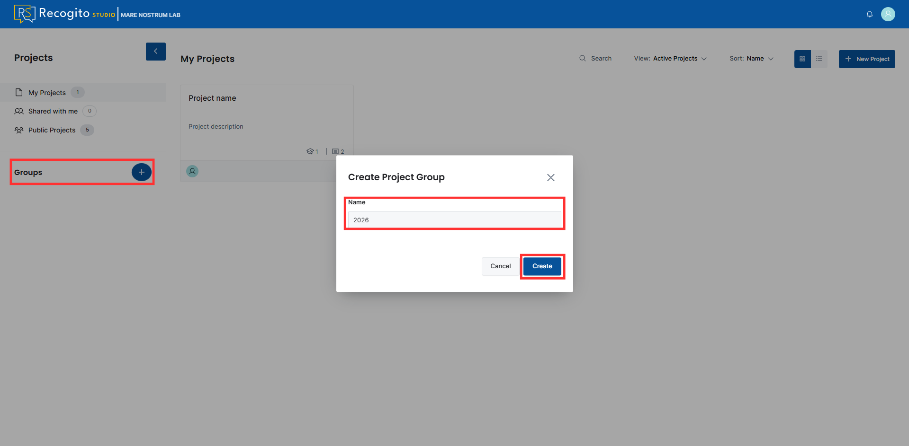

1. Go to the created group and add a project. You can select from existing or create a new project that will be assigned to that group.

    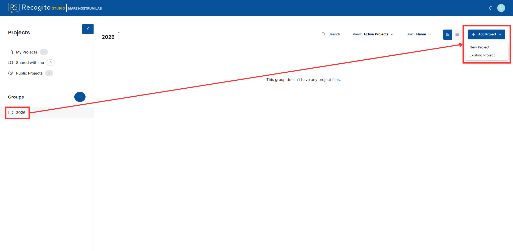

---

## Annotate TEI Texts and PDF Files

???+ note "Inspect annotations"
    You can inspect existing annotations by opening a dedicated pane on the right side of the page.

1. Choose and open a TEI or PDF document.

1. Mark the pieces of text you want to annotate, provide content for the annotation, and save them.

    ???+ note
        You can add tags to create thematic groups for the annotations.

    ???+ note
        You can add Web URL links, Image URL links and YouTube links to your annotation.

    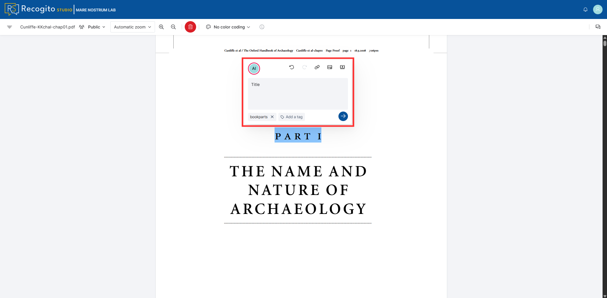

---

## Annotate IIIF, JPG and PNG Images

???+ note "Inspect annotations"
    You can inspect existing annotations by opening a dedicated pane on the right side of the page.

1. Choose and open a IIIF, JPG or PNG image.

1. Select the rectangular or multiangular marking mode, outline the elements of interest, provide annotation contents, and save.

    ???+ note
        You can add tags to create thematic groups for the annotations.

    ???+ note
        You can add Web URL links, Image URL links and YouTube links to your annotation.

    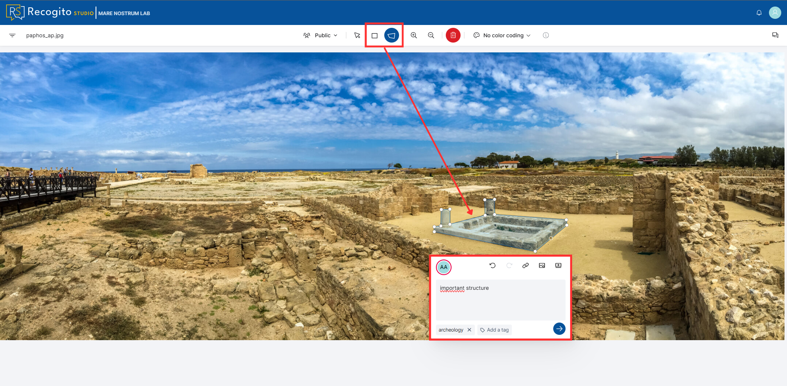

---

## Geotagger Plugin

### Install Plugin in Your Project

???+ note "Plugins availability"
    Note that plugins are available per project. This means you need to enable them in each project independently.

1. To enable a plugin, open a project as a **Project Admin**.

1. Go to **"Settings"**.

    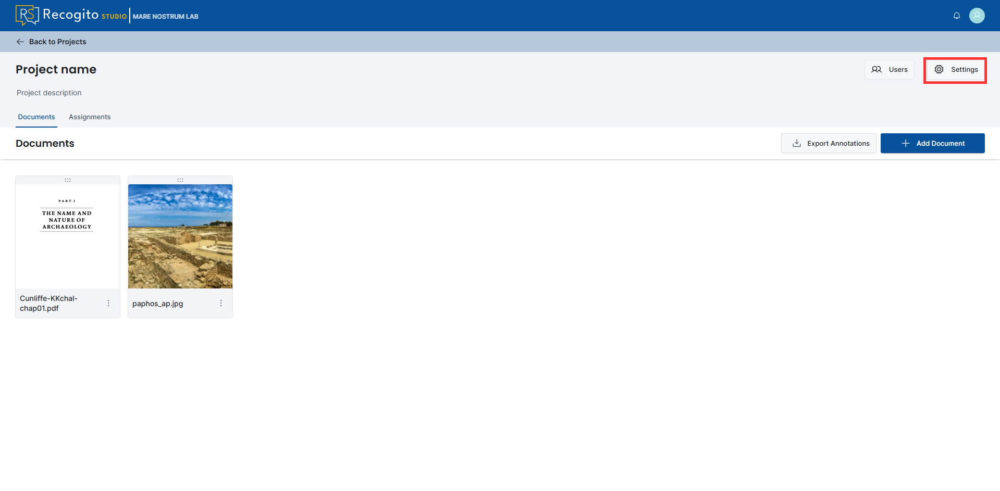

1. Next, press the **"Plugins"** tab, click the **"Browse Available Plugins"** button, and install the listed plugin.

    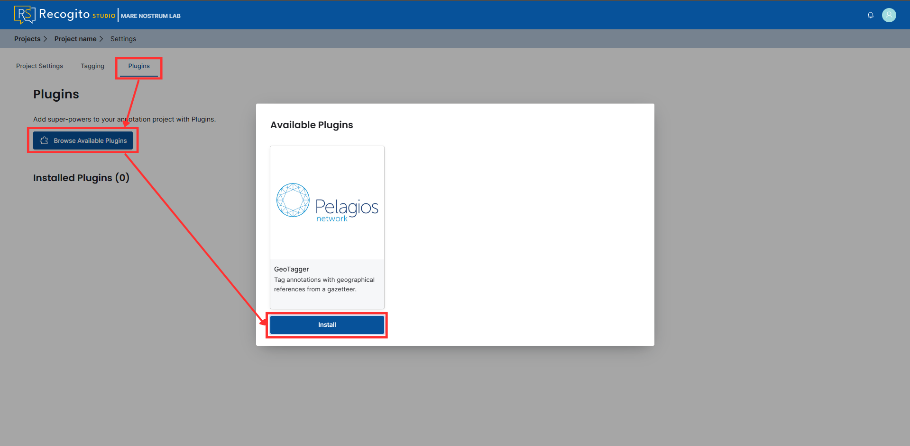

1. Add gazetteers and save the settings.

    ???+ note "Plugin limitations"
        Unfortunatelly, the Core Data gazetteer does not work properly. Including it in your project may cause plugin instabilities.

    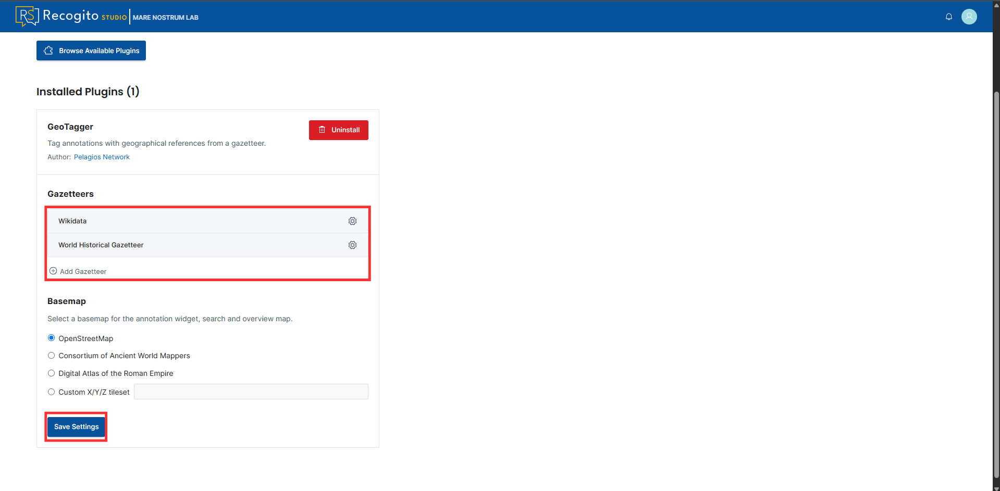

---

### Annotate with Location

1. [Install plugin in your project](#install-plugin-in-your-project).

1. Mark the text or part of the image and click the **"Add Geo-Tag"** button.

    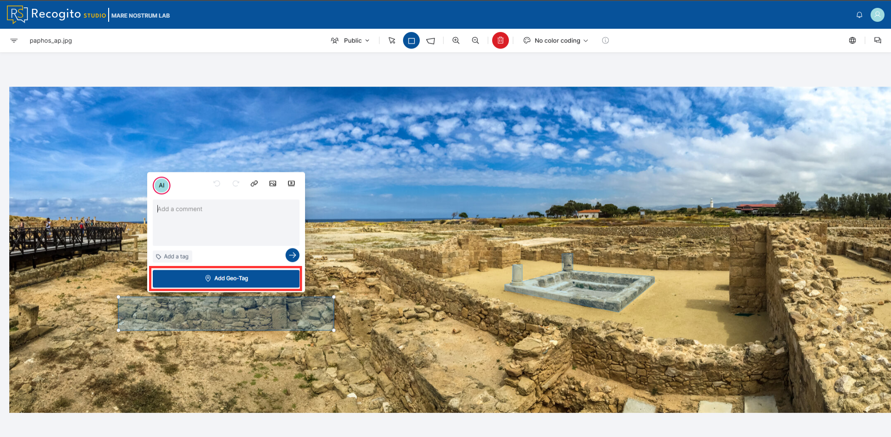

1. Provide a fragment of text. The plugin will automatically match the sentence with the closest tag in the gazetteers. If you are satisfied you can confirm it.

    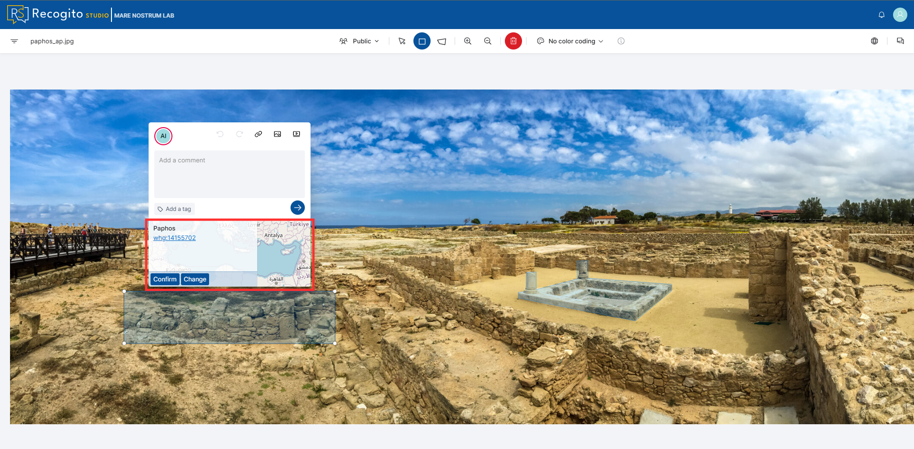

1. (Optional) If you are not satisfied with the automatic proposition, click **"Change"**, type your text in the dedicated field and choose from displayed list or from the map points.

    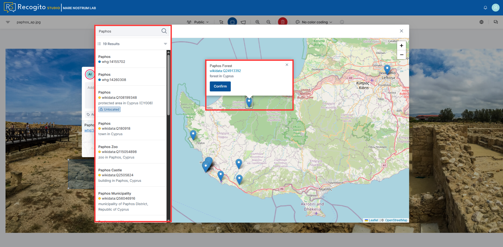

---