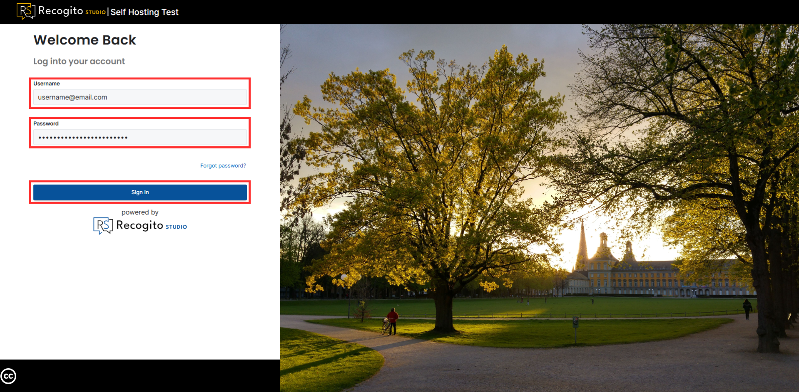

# Recogito Studio Management Documentation

**[Recogito Studio](https://recogito.mn.cenagis.edu.pl/)** is a part of the Mare Nostrum LAB system. This tool is dedicated to collaborative annotation of [TEI Texts](https://tei-c.org/), [IIIF Images](https://iiif.io/) and PDFs built on a modern platform that is designed to be easy to use.

Besides its main functionalities, Recogito Studio offers additional plugins that expand its functionality with specific types of tags. In Mare Nostrum LAB project, we offer a dedicated **Mare Nostrum Plugin** that allows the use of Mare Nostrum Thesaurus items as tags inside the Recogito.

To access the code repository visit [Mare Nostrum LAB GitLab](https://gitlab.cenagis.edu.pl/uavgeolab/mare-nostrum/recogito).

---

## Quick Start

### Login to Recogito Studio

1. Visit `recogito.mn.cenagis.edu.pl` website or click [here](https://recogito.mn.cenagis.edu.pl/en/sign-in).

1. Provide your **Username** and **Password**, then click **"Sign In"** button.

    

---

### Create New Project

---

### Annotate TEI Texts

---

### Annotate IIIF Images

---

### Annotate PDF Files

---

### Export annotations

---

### Enable Plugin to Your Project

???+ note "Plugins availability"
    Note that, plugins are available per project. It means that you need to turn them on in every project independently.

1. To enable a plugin, open a project as a **Project Admin**.

1. Go to **"Project Settings"**, then **"Plugins"** and click **"Browse Available Plugins"**.

1. As a result, compiled plugins (GeoTagger and Mare Nostrum LAB plugin) will be listed.

1. Enable intended plugins.

1. Visit your project and verify that functions provided by the plugin are available.

---

### Mare Nostrum LAB plugin