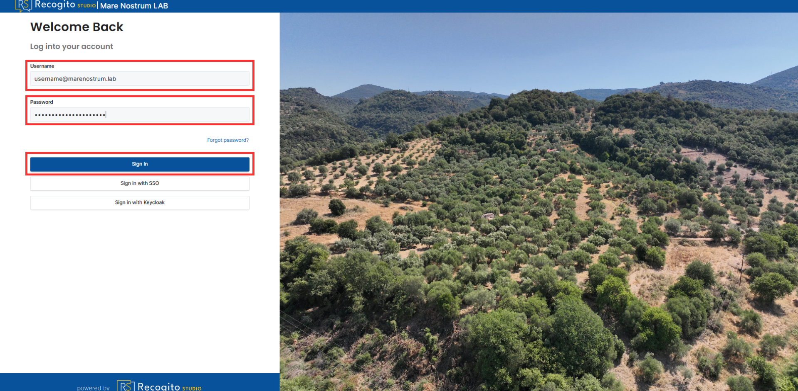
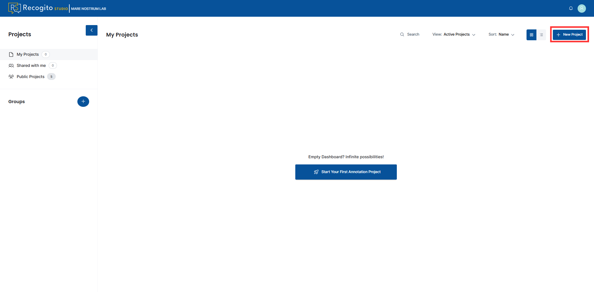
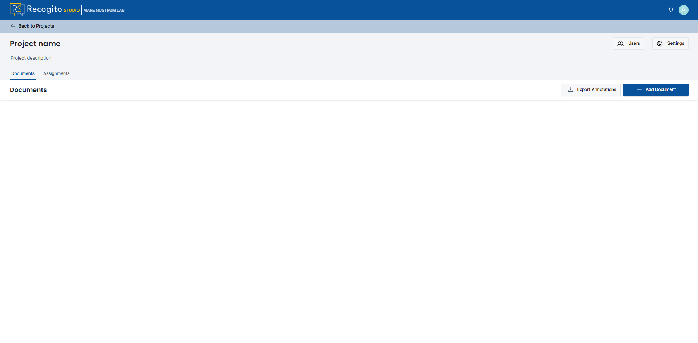
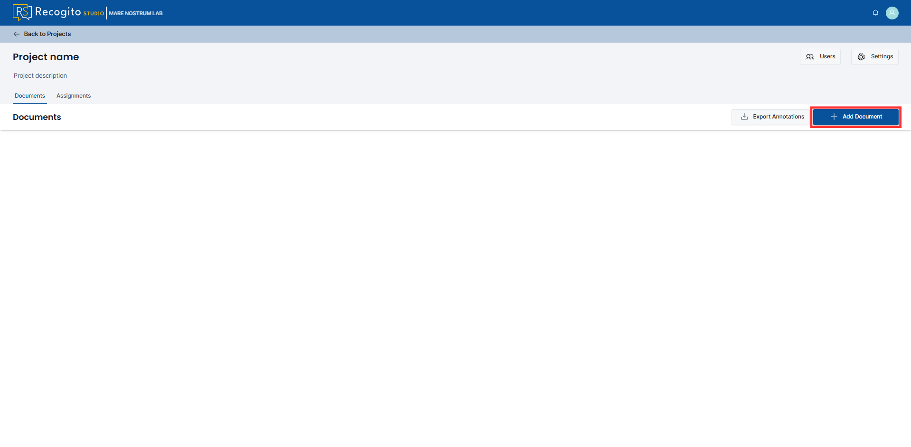
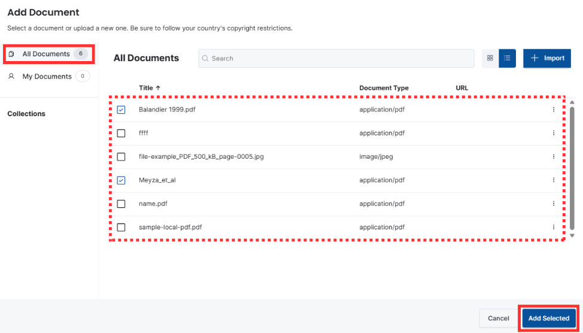

# Recogito Studio Management Documentation

**[Recogito Studio](https://recogito.mn.cenagis.edu.pl/)** is a part of the Mare Nostrum LAB system. This tool is dedicated to collaborative annotation of [TEI Texts](https://tei-c.org/), [IIIF Images](https://iiif.io/) and PDFs, built on a modern platform designed to be easy to use.

Besides its main functionalities, Recogito Studio offers additional plugins that expand its functionality with specific types of tags. In Mare Nostrum LAB project, we offer a dedicated **Mare Nostrum Plugin** that allows the use of Mare Nostrum Thesaurus items as tags inside the Recogito.

To access the code repository visit [Mare Nostrum LAB GitLab](https://gitlab.cenagis.edu.pl/uavgeolab/mare-nostrum/recogito).

---

## Quick Start

### Login to Recogito Studio

1. Visit `recogito.mn.cenagis.edu.pl` website or click [here](https://recogito.mn.cenagis.edu.pl/en/sign-in).

1. Provide your **Username** and **Password**, then click **"Sign In"** button.

    

---

### Create New Project

???+ note "User priviledges"
    To create a new project, you need to have a proper organization role, which means having a `Professor` or `Admin` role. Further information can be found here.

1. [Login to Recogito Studio](#login-to-recogito-studio).

1. Press a **"New Project"** button in the top right corner of the page.

    

1. Provide the project name and description, set projects properties, and press the **"Create"** button.

    ???+ note "Project properties - Project Visibility"
        You can select two options in Project Visibility section:

        - **Private** - project is visible only to the admin and users who join after receiving an admin invitation.
        - **Public** - any registered user can access the project by visiting the **"Public Projects"** section.

    ???+ note "Project properties - Project Type"
        You can select two options in Project Type section:

        - **Assignments** - project admins create assignments with specific documents, and team members fulfil the given tasks.
        - **Single Team** - project members can annotate any document.

    

1. Upon creating, an empty project page will be displayed. 

    

---

### Add New Document

1. [Create](#create-new-project) or open a project.

1. Press the **"Add Document"** button in the top right corner.

    

1. Press the **"Import"** button and select a file from your device or provide a IIIF manifest.

    

1. (Optional) Go to the **"All documents"** section and select documents of interest from the list of publicly available ones across the organization.

    

1. Wait for processing, which ends with a confirmation message and a new document object.

    ???+ note
        To inspect the document from the adding panel, you need to refresh the page by hand.

    

### Annotate TEI Texts

---

### Annotate IIIF Images

---

### Annotate PDF Files

---

### Export annotations

---

### Enable Plugin to Your Project

???+ note "Plugins availability"
    Note that, plugins are available per project. It means that you need to turn them on in every project independently.

1. To enable a plugin, open a project as a **Project Admin**.

1. Go to **"Project Settings"**, then **"Plugins"** and click **"Browse Available Plugins"**.

1. As a result, compiled plugins (GeoTagger and Mare Nostrum LAB plugin) will be listed.

1. Enable intended plugins.

1. Visit your project and verify that functions provided by the plugin are available.

---

### Mare Nostrum LAB plugin